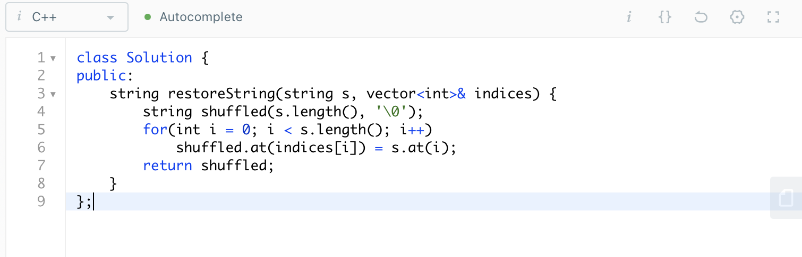

面试题 01.03. URL化
URL化。编写一种方法，将字符串中的空格全部替换为%20。假定该字符串尾部有足够的空间存放新增字符，并且知道字符串的“真实”长度。（注：用Java实现的话，请使用字符数组实现，以便直接在数组上操作。）

1528. 重新排列字符串
给你一个字符串 s 和一个 长度相同 的整数数组 indices 。
请你重新排列字符串 s ，其中第 i 个字符需要移动到 indices[i] 指示的位置。
返回重新排列后的字符串。

      
来源：力扣（LeetCode）

